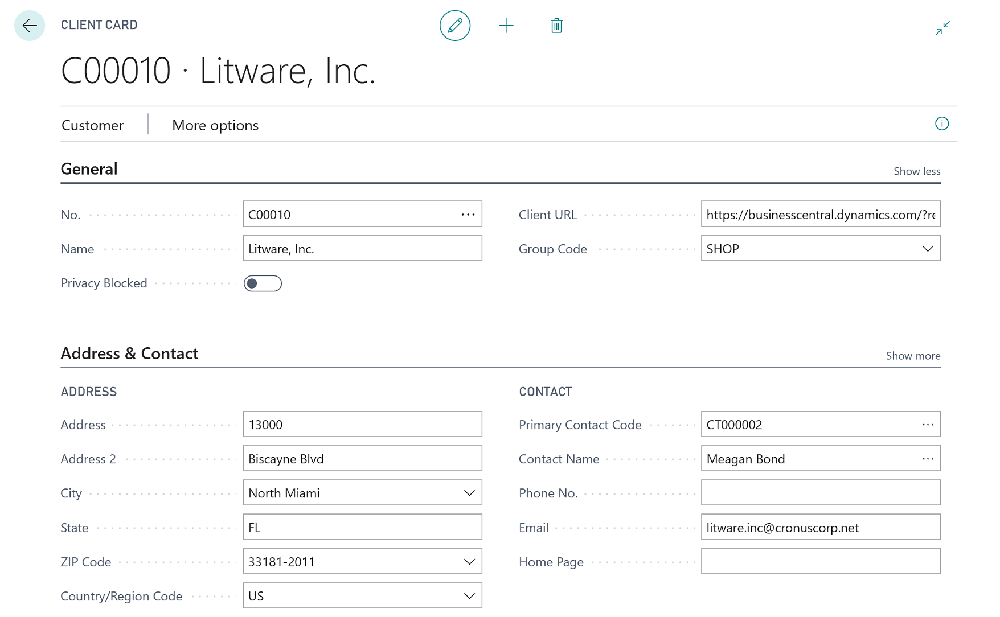

[!INCLUDE[d365fin_early_release](includes/d365fin_early_release.md.md)]

# Add Clients to Your Dashboard in [!INCLUDE[d365acc_long](includes/d365acc_long_md.md)]
You can add a client by using the **Clients** window, which you can open by choosing the **Manage Clients** action in the ribbon. Simply choose **New** and then fill in the fields.  

The data in the card for each client is specified by you, and you can change it as needed. However, the **Client URL** field is critical - this is how you can access each client's [!INCLUDE[d365fin](includes/d365fin_md.md)]. Use the **Test Client URL** action in the ribbon to test that you entered the right link. The URL that you must enter points at the client's [!INCLUDE[d365fin](includes/d365fin_md.md)], such as *https://mybusiness.financials.dynamics.com*. This URL is then used when you choose the **Go To Company** menu item in the [!INCLUDE[d365acc](includes/d365acc_md.md)] dashboard.  

<!--If you have been invited to a client's [!INCLUDE[d365fin](includes/d365fin_md.md)] and signed in with your work account, then the client will be added to your dashboard in the accountant portal. -->

### Get Invited to a Client's [!INCLUDE[d365fin_long](includes/d365fin_long_md.md)]
A company who use [!INCLUDE[d365fin](includes/d365fin_md.md)] can invite you to [!INCLUDE[d365fin](includes/d365fin_md.md)] as their external accountant. To get invited, you must give them the email that you use with [!INCLUDE[d365acc](includes/d365acc_md.md)], such as *me@accountant.com*. Your client's administrator can then add you to their system by running the **Invite External Accountant** wizard.  

As a result, you will receive email from your client with a link to their [!INCLUDE[d365fin](includes/d365fin_md.md)]. Click the link, and you are logged in and can access their financial data from the **Accountant** Role Center. For more information, see [Accountant Experiences in [!INCLUDE[d365fin](includes/d365fin_md.md)]](/dynamics365/financials/finance-accounting?toc=/dynamics365/accountants/toc.json).  

You can then add the client to your dashboard in [!INCLUDE[d365acc_long](includes/d365acc_md.md)] as described above.  

## See Also
[Get Started with Accountant Hub](accountant-get-started.md)  
