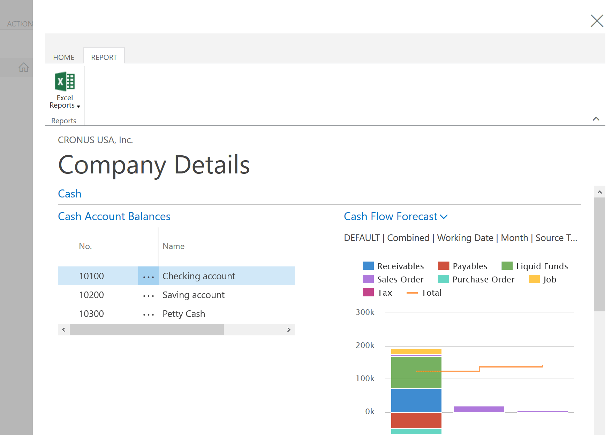

# Get started with [!INCLUDE[d365acc_long](includes/d365acc_long_md.md)]
Any business must do its books and sign off on the accounting. Some businesses employ an external accountant, and others have an accountant on staff. If you are an accountant with several clients, you can use [!INCLUDE[d365acc](includes/d365acc_md.md)] as your dashboard for a better overview of your clients.  

## Accountant Hub
You can get access to [!INCLUDE[d365acc_long](includes/d365acc_md.md)] by signing up from [Dynamics 365 — Accountant Hub on Microsoft.com](https://www.microsoft.com/en-us/dynamics365/financial-insights-for-accountants).  

> [!TIP]  
>  When you sign up for [!INCLUDE[d365acc](includes/d365acc_md.md)], you must specify your work email address, such as *me@accountant.com*. We recommend that you use the same email address when you work in your clients' [!INCLUDE[d365fin_long](includes/d365fin_long_md.md)], so that you can easily switch between clients.  

### Adding Clients
You can add a client by using the **Clients** window, which you can open by choosing the **Manage Clients** action in the ribbon. Simply choose **New** and then fill in the fields.  

The data in the card for each client is specified by you, and you can change it as needed. However, the **Client URL** field is critical - this is how you can access each client's [!INCLUDE[d365fin](includes/d365fin_md.md)]. Use the **Test Client URL** action in the ribbon to test that you entered the right link. The URL that you must enter points at the client's [!INCLUDE[d365fin](includes/d365fin_md.md)], such as *https://mybusiness.financials.dynamics.com*. This URL is then used when you choose the **Go To Company** menu item.  

<!--If you have been invited to a client's [!INCLUDE[d365fin](includes/d365fin_md.md)] and signed in with your work account, then the client will be added to your dashboard in the accountant portal. -->

### Get Invited to a Client's [!INCLUDE[d365fin_long](includes/d365fin_long_md.md)]
A company who use [!INCLUDE[d365fin](includes/d365fin_md.md)] can invite you to [!INCLUDE[d365fin](includes/d365fin_md.md)] as their external accountant by using a wizard. Also, we recommend that you enter the email that you plan to use for your accounting work - that way, you can choose if you want to use *me@accountant.com* or *me@client.com*  

As a result, you will receive email from your client with a link to their [!INCLUDE[d365fin](includes/d365fin_md.md)].  

You can then access their financial data from the **Accountant** Role Center. For more information, see [Accountant Experiences in [!INCLUDE[d365fin](includes/d365fin_md.md)]](/dynamics365/financials/finance-accounting).  

### Working with Individual Clients
The dashboard shows the most important information about each client.  

The **Client Name** column shows the names of your clients, and the **Company Name** column lists all companies if the client has more than one company in [!INCLUDE[d365fin_ong](includes/d365fin_long_md.md)]. You can customize the dashboard to show the data points that you want to see by adding or removing columns. For example, you might want to see taxes that are due, how many open sales documents each client has, or the number of purchase invoices that are due next week. You can configure the view to suit your needs. If you have many clients, you can use filters to sort your view.  

Next to the client name, the ellipsis (...) reveals a short menu:

-   Refresh the current company and get fresh data for the client  
-   Go to the client's [!INCLUDE[d365fin](includes/d365fin_md.md)]  
-   Select more clients  

Similarly, you can use the **Client Summary** drop-down menu to refresh all companies, for example.  

> [!TIP]  
>  To access a client's [!INCLUDE[d365fin](includes/d365fin_md.md)], choose the **Go To Client** menu item - you are logged in automatically.

### Company Details
You can see more information about your clients' data by choosing the name of the company that you want to learn more about. This opens the **Company Details** pane, where you can see additional information, such as the following:  

* Cash account balances  
* Cash flow forecast  
* Overdue purchase invoices  
* Overdue sales invoices  

Technically, you have now logged into your client's [!INCLUDE[d365fin](includes/d365fin_md.md)], and data you see is live data. If you want to take a closer look at the data, such as an overdue purchase invoice, choose the link, and you are taken to the client company.  

> [!TIP]  
>  You can launch predefined Excel workbooks from the **Reports** tab in the ribbon. These Excel workbooks are designed as ready-to-print key financial statements and reports, but you can also modify them to fit your needs. For more information, see [Analyzing Financial Statements in Microsoft Excel](/dynamics365/financials/finance-analyze-excel).  

Otherwise, close the details pane and continue to the next client.  

## See Also
[Welcome to Dynamics 365 — Accountant Hub](index.md)  
[Accountant Experiences in [!INCLUDE[d365fin](includes/d365fin_md.md)]](/dynamics365/financials/finance-accounting)  
[Dynamics 365 — Accountant Hub on Microsoft.com](https://www.microsoft.com/en-us/dynamics365/financial-insights-for-accountants)  
