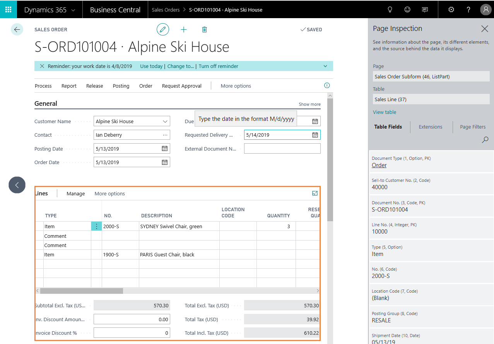

# Inspecting Pages in in Business Central

The page inspection feature enables you to get details about a page, providing insight into the page design, the different elements that comprise the page, and the source behind the data it displays.

Page inspection is especially designed for administrators, power users, support personnel, and developers. Page inspection helps you:

- Learn the data model behind a page.

- Discover pages and parts that can be reused in you application design.

- Troubleshoot data issues without having to perform tasks like copying the production database, viewing the entire source table, or digging into SQL.

- Debug the application, complementing [Designer](https://docs.microsoft.com/en-us/dynamics365/business-central/dev-itpro/developer/devenv-inclient-designer).

## Working with Page Inspection

To inspect a page, in the top right corner, choose , then choose **Inspect**. Or, you can use the keyboard shortcut Crtl+Alt+F1.

The **Inspect Page** pane opens on the right side. The following figure illustrates the **Page Inspection** pane on the **Sales Order** page.

When the **Page Inspection** pane first opens, it shows information that pertains to the main page object.

Use the keyboard or pointing device to move focus to different elements on the page. When you select a sub-page in a part of the main page or FactBox, the related area is highlighted by an orange border, and the **Page Inspection** pane shows information about the selected element. For example, the previous figure shows information about the list part in the **Sales Order** page.

As you navigate to other pages in the application, the **Page Inspection** pane will automatically update with page information as you move along.

## What Page Inspection Shows

In short, the page inspection pane shows the information for any page or sub-page in a part, including its source table (if any), fields, extensions that affect the page, and filters. The following section describe details about what is shown.

### [Page](#tab/page)

The **Page** field shows information about the main page or a selected (highlighted) sub-page in a part. The field shows the following information:

- The name, as specifed by its [Name property](https://docs.microsoft.com/en-us/dynamics365/business-central/dev-itpro/developer/properties/devenv-name-property)
- The ID as specifed by the [ID property](https://docs.microsoft.com/en-us/dynamics365/business-central/dev-itpro/developer/properties/devenv-id-property).
- The type, as specified by the [PageType property](https://docs.microsoft.com/en-us/dynamics365/business-central/dev-itpro/developer/properties/devenv-pagetype-property).

#### Elements shown with limited information  

- Role Center page types
    
    If a page has the type Role Center, the **Table** field does not appear, and the text **This is a Role Center page** is shown instead. Because the Role Center consists of several parts, there is no more information shown. To see more details, select the different parts that make up the page.

- Report request pages and previews

    If you open a report request page or preview for inspection, the only information that is shown in the Page Inspection pane is the report's name and ID.

- System parts, such as Links, Notes, and Charts.

### [Table](#tab/table)

The **Table** field displays information about the source table of the main page or the selected page in a part, as specified by the page's [SourceTable property](https://docs.microsoft.com/en-us/dynamics365/business-central/dev-itpro/developer/properties/devenv-sourcetable-property). The **Table** field shows the following information:

- The name, as specifed by its [Name property](https://docs.microsoft.com/en-us/dynamics365/business-central/dev-itpro/developer/properties/devenv-name-property)
- The ID as specifed by the [ID property](https://docs.microsoft.com/en-us/dynamics365/business-central/dev-itpro/developer/properties/devenv-id-property).

- If the page does not have a source table.

#### View Table

If a page has a source table, the **View table** link is available. This  link will open the table in a separate browser window, allowing you to see all records and fields in the table.

To view a table, above having read permission on the table, you must have execute permission on the system object **1350 Run Table**. This is granted by in permission set on your user account. 

### [Table Fields](#tab/tablefields)

The **Table Fields** tab displays information about all fields in the source table for the current record, including those fields that do not appear on the page.

Each field is shown with the following information:

- Field name as specified by the [Name property](https://docs.microsoft.com/en-us/dynamics365/business-central/dev-itpro/developer/properties/devenv-name-property).
- Field number as specified by the [Field No property](https://docs.microsoft.com/en-us/dynamics365/business-central/dev-itpro/developer/properties/devenv-field-no.-property).
- Data type as specified by the [Data Type property](https://docs.microsoft.com/en-us/dynamics365/business-central/dev-itpro/developer/properties/devenv-data-type-property).
- If the field is a primary key, it is indicated by **PK**. A primary is  specified by the [Key property](https://docs.microsoft.com/en-us/dynamics365/business-central/dev-itpro/developer/properties/devenv-key-property).
- Value of the field.

#### What field information is not shown

- Page fields that are not bound to the source table by the [SourceExp property](https://docs.microsoft.com/en-us/dynamics365/business-central/dev-itpro/developer/properties/devenv-sourceexpr-property)
- Fields in temporary tables.
- The value of fields that have a data type of blob, byte, media, or mediaset.

## [Extensions](#tab/extensions)

The **Extensions** tab displays extensions that are installed on the tenant and affect the selected page or source table.

The data shown is defined in the app.json of the ex

There are four different types:

- **Adds page** indicates that the extensions adds the page object.
- **Extends page** indicates that the extension modifies the page, like adding a field, and action, or code. In AL, this is specified by a page extension object.
- **Adds table** indicates that the extensions adds the table object.
- **Extends table** indicates that the extension modifies the source table, like adding a field or code. In AL, this is specified by a table extension object.  

## [Page Filters](#tab/pagefilters)

The **Page Filters** tab displays the current filters used on the current page. This includes those that are set by code, Views, or user-defined.

## See Also  